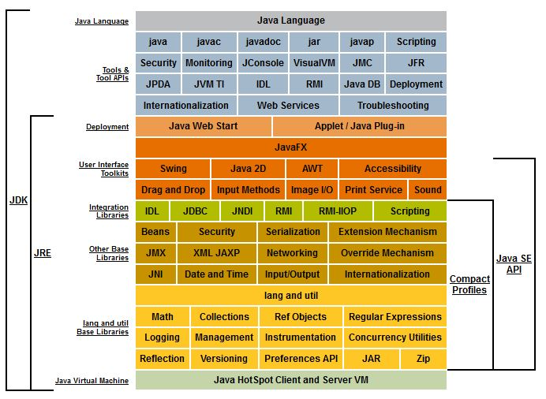
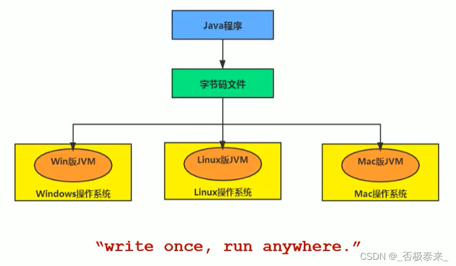
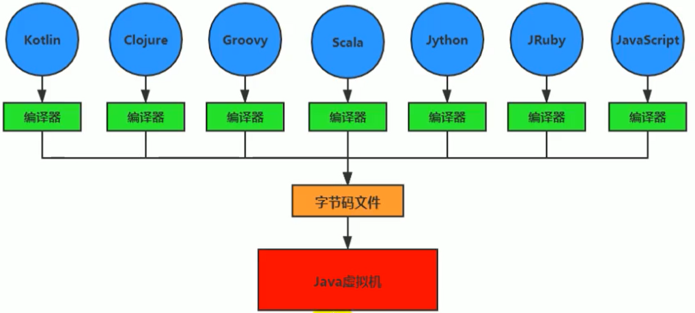
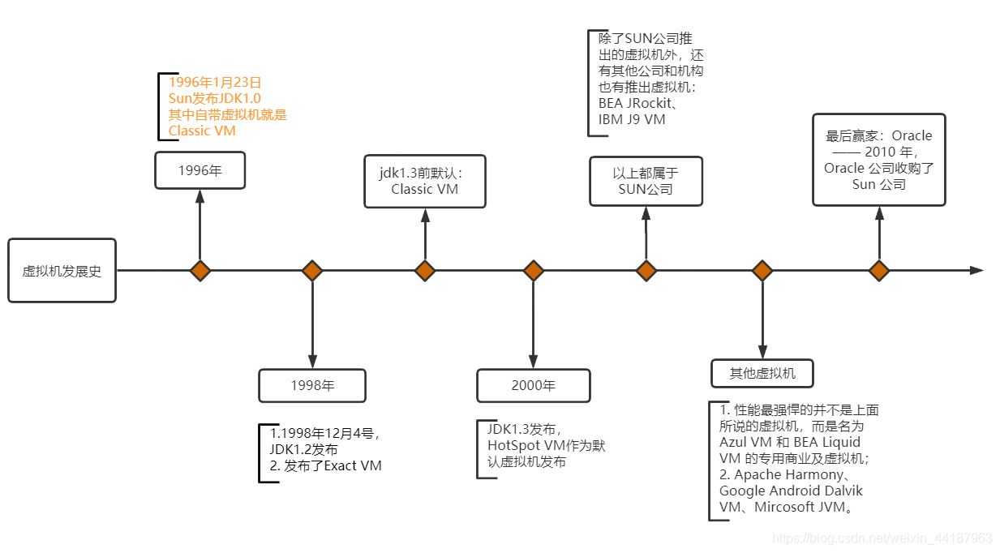

# JVM Study

## JDK & JRE & JVM
  
來源: [Java beginner for Oracle DBA](http://www.ohsdba.cn/index.php?m=Article&a=show&id=455 )

## Java 平台
### JavaEE(Java Platform, Enterprise Edition)
Java EE是一系列技術標準所組成的平台，包括：
* EJB - 企業級JavaBean（Enterprise Java Beans）
* JAAS - Java Authentication and Authorization Service
* JACC - J2EE Authorization Contract for Containers
* JAF - Java Beans Activation Framework
* JAX-RPC - Java API for XML-Based Remote Procedure Calls
* JAX-WS - Java API for XML Web Services
* JAXM - Java API for XML Messaging
* JAXP - Java XML解析API（Java API for XML Processing）
* JAXR - Java API for XML Registries
* JCA - J2EE連接器架構（J2EE Connector Architecture）
* JDBC - Java資料庫聯接（Java Database Connectivity）
* JMS - Java訊息服務（Java Message Service）
* JMX - Java Management
* JNDI - Java名稱與目錄介面（Java Naming and Directory Interface）
* JSF - Java Server Faces
* JSP - Java伺服器頁面（Java Server Pages）
* JSTL - Java伺服器頁面標準標籤庫（Java Server Pages Standard Tag Library）
* JTA - Java事務API（Java Transaction API）
* JavaMail
* Servlet - Java Servlet API
* StAX - Streaming APIs for XML Parsers
* WS - Web Services
* Applet - Java Applet

### JavaME(Java Platform, Micro Edition)
Java ME以往稱作J2ME（Java Platform, Micro Edition）是為機上盒、
行動電話和PDA之類嵌入式消費電子裝置提供的Java語言平台，包括虛擬機器和一系列標準化的Java API
開發Java ME程式一般不需要特別的開發工具，開發者只需要裝上Java SDK及下載免費的
Sun Java Wireless Toolkit就可以開始編寫Java ME程式，編譯及測試

### JavaSE(Java Platform, Standard Edition)
標準版的Java平台是一個Java2的平台，為使用者提供一個程式開發環境

## Java 跨平台的語言

## JVM 跨語言的平台

## .class 二進制檔
.class 為編譯器編譯過後的檔案，可透過 JVM 執行內部程式
.class 有特定規範若滿足規範不管任何語言都可編譯成 .class 檔
[Java位元組碼](https://zh.wikipedia.org/zh-tw/Java%E5%AD%97%E8%8A%82%E7%A0%81)

## JVM 演進歷史

