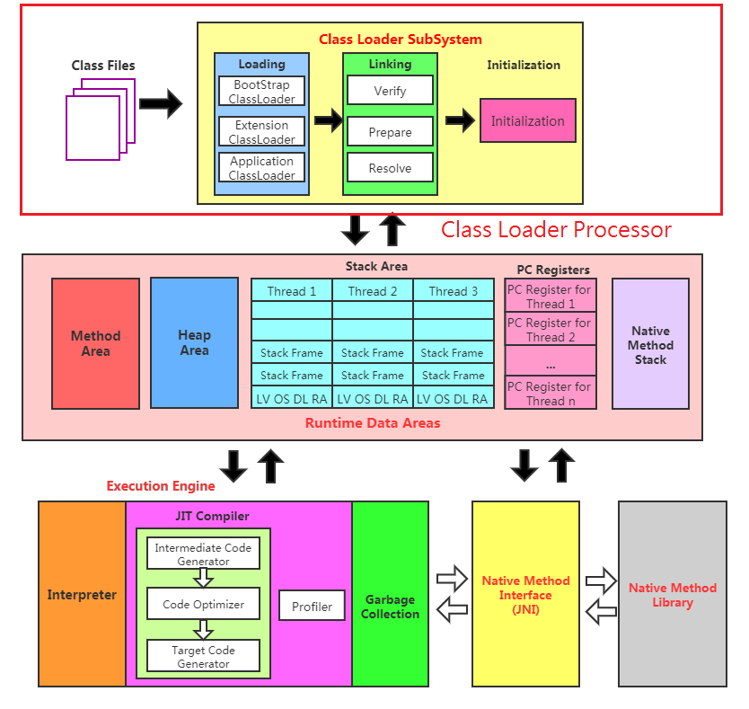

# Class Loader SubSystem
## Class Loader Processor 三大階段
1. Loading: 從文件系統或網路中加載讀取 .class 二進制檔案
2. Linking: 驗證、準備及解析記憶體中的 .class 二進制檔案內容
3. Initialization: 初始化 .class  內屬性及方法

## Class Loading 作用
1. 從 .class file 中讀取物件
2. class file 加載至 JVM 中的 DNA 元數據模板並放置在方法區，後續建立實體都會透過元數據模板建立
3. 在 .class -> JVM -> 最終成為元數據(metadata)需要一個傳遞者，而 ClassLoader 則扮演此角色

## 物件加載過程

## Class Loading 階段
1. 通過一個物件的全名(包含 package)獲得物件的二進制檔
2. 將物件的二進制檔靜態儲存轉換儲存至JVM方法區內執行時期數據
3. 記憶體中生成一個代表這的物件的 java.lang.Class 物件，作為訪問這個物件的入口
###### 補充: 獲取 .class 文件的來源
1. 本機硬碟內靜態儲存.class檔案
2. 通過網路獲得，例: Web Applet
3. 從zip壓縮中讀取，為日後的jar、war格式基礎
4. 執行時其生成，例: 動態代理
5. 由其他文件生成，例: JSP
6. 從專有資料庫取得.class文件，較少應用
7. 從加密文件中獲得，例: 防Class文件被反編譯保護措施

## Class Linking 階段
### 驗證(Verify)
1. 目的是確保Class文件的二進位檔中包含信息是否符合虛擬機要求，確保能夠正確加載回不危害到虛擬機執行
2. 主要包含四種驗證: 文件格式驗證、元數據驗證、二進制檔驗證、符號引用驗證
### 準備(Prepare)
1. 為靜態變數(static)分配記憶體位址並設定該型態預設初始值，即零值
2. 這裡不包含用final修飾的static變數，因為final在編譯時候就會分配記憶體位址，準備階段只是做顯示初始化
3. Prepare 階段不會為物件變數分配記憶體及初始化，靜態變數會分配到方法區中，而物件變數則是跟著物件建立時生成到Java Stack 中
### 解析(Resolve)
1. 將常數池(constant pool)內的符號引用轉換為直接引用
2. 通常解析過程會在JVM執行完初始化後執行
3. 符號號引用為利用一組符號來指向目標，符號引用的格式明確規定在 `java 虛擬機規範` 中的 Class 文件格式中，直接引用為直接指向目標的位址、相對偏移量或是間接定位報目標
4. 解析動作主要針對class、interface、物件變數、method、interface method、方法類型等，對應到常數池中的 CONSTANT_Class_info、CONSTANT_Fieldref_info、CONSTANT_Methodref_info 等

## Class Initialization 階段
1. 初始化階段就是執行class 建構子方法 `<clinit>()` 的過程
2. 此階段不需定義，是由 javac 編譯自動收集物件中所有變數的給值和靜態程式碼區塊(static{})中的合併而來
3. 建構子方法中指令依照語句在原文件中出現的順序
4. `<clinit>() 不同於物件中的建構子` (相關資訊: `建構子是虛擬機視角下的 <init> ()`)
5. 若物件具有父類別，JVM 會保證子類別的 `<clinit>()` 執行前，父類別的`<clinit>()`已經執行完畢
6. 虛擬機必須確保一個物件的`<clinit>()` 必須在多執行緒下同步

## ClassLoader 分類
1. JVM 支持兩種類型的類別加載器啟動類別加載器(Bootstrap ClassLoader)和自定義類別加載器(User-Defined ClassLoader)
2. Java 中自定義類別加載器通常指所有衍生於ClassLoader類別加載器都劃分為自定義類別加載器(User-Defined ClassLoader)

## 啟動類別加載器(BootstrapClassLoader)
1. 啟動類別加載器是由C/C++所撰寫，內嵌在JVM中
2. 啟動類別加載器是用來加載Java的核心函式庫(JAVA_HOME/jre/lib/rt.jar、resources.jar或是sun.boot.class.path路徑下的內容)用於提供JVM本身需要的物件
3. 啟動類別加載器並不繼承 java.lang.ClassLoader，沒有父加載器
4. 啟動類別加載器出於安全考量指加載 java、javax、sun 開頭的函式庫
5. 啟動類別加載器加載應用程式類別加載器(AppClassLoader)、延伸類別加載器(ExtClassLoader)，並指定父加載器都為啟動類別加載器

## 延伸類別加載器(ExtClassLoader)
1. 延伸類別加載器是由Java所撰寫，由sun.misc.Launch$ExtClassLoader實作
2. 為ClassLoader 衍伸
3. 父加載器為啟動類別加載器(BootstrapClassLoader)
4. 從java.ext.dirs系統屬性指定的路徑下加載函式庫或從JDK的安裝目錄中的jre/lib/ext子目錄下加載物件，若將jar檔放置此目錄底下也會加載

## 應用程式類別加載器/系統類別加載器(AppClassLoader)
1. 延伸類別加載器是由Java所撰寫，由sun.misc.Launch$AppClassLoader實作
2. 為ClassLoader 衍伸
3. 父加載器為啟動類別加載器(BootstrapClassLoader)
4. 應用程式類別加載器負責加載classpath環境變數或系統屬性java.class.path下的函式庫
5. 應用程式類別加載器為Java程式中預設的加載器
6. 通過ClassLoader#getSystemClassLoader()方法可以獲得應用程式類別加載器

## 自定類別加載器使用場景
1. 隔離所要加載的類別(名稱衝突)
2. 修改類別加載器方法(除BootstrapClassLoader以外)
3. 擴展加載來源
4. 防止程式碼洩漏竄改(加解密)

## 自定類別加載器流程
1. 繼承 java.lang.ClassLoader 抽象類別
2. JDK1.2之前繼承 java.lang.ClassLoader 抽象類別以外需複寫 loadClass()方法，但之後的版本不建議複寫，而是將自定邏輯寫在findClass()方法內
3. 若是自定類別加載器無太複雜邏輯可直接繼承URLClassLoader節省自行撰寫findClass()方法

## 抽象 ClassLoader

## 獲得 ClassLoader 方法
1. clazz.getClassLoader(): 獲得當前類別加載器
2. Thread.currentThread().getContextClassLoader(): 獲取檔前執行緒上下文的類別加載器
3. ClassLoader.getSystemClassLoader(): 獲得系統類別加載器
4. DriverManager.getCallerClassLoader(): 獲得調用者的 ClassLoader(Java native interface method)

## 雙親委託模型
Java的雙親委託模型是指當Java程式需要載入某個類別時，它會先向上尋找該類別是否已經被載入。具體而言，Java會先請求父類別載入器載入該類別，如果父類別載入器無法找到該類別，則會請求父類別載入器的父類別載入器載入該類別，以此類推，直到最上層的載入器。  
這個模型有助於確保Java平台上的類別載入器只載入它們負責的部分，從而確保程式的安全性和可靠性。如果沒有這種模型，可能會導致程式載入不必要的類別，並且可能存在安全風險。
### 優勢
1. 可避免重複類別加載
2. 保護核心函式庫，避免被竄改

## 安全執行環境機制
Java的安全執行環境，也稱為沙箱（sandbox），是一個重要的安全機制，用於保護Java程式不受惡意程式的影響，防止未經授權的行為和保護系統免於被損壞。  
當Java程式運行時，它會被限制在一個虛擬的運行環境中，稱為沙箱。這個環境通過限制程式對系統的訪問權限，確保程式只能執行安全和授權的操作。這包括限制對系統文件和資源的訪問權限，以及限制對網絡的訪問權限。
具體而言，安全執行環境實現了以下安全機制：
1. 限制Java程式的系統訪問權限：Java程式不能直接訪問系統資源，例如檔案、網絡端口和系統設定。如果程式需要訪問這些資源，則必須通過Java安全管理器進行授權。 
2. 虛擬機隔離：每個Java程式都運行在自己的虛擬機中，從而確保不同程式之間的隔離和保護。 
3. 程式碼驗證：Java編譯器和執行環境會對程式碼進行驗證，以確保它符合Java安全標準。
4. 安全管理器：Java安全管理器確保了Java程式只能執行已經授權的操作，並且可以對不安全的程式進行防範措施，例如拒絕程式的訪問權限。

## 其他
在 JVM 加載類別時判斷是否為同一個class物件條件具有兩種
1. 類別的全名稱(package + className)相同
2. ClassLoader 加載器必須相同
即使只要是在JVM中兩的類別來源同一個.class檔案，被同一個JVM加載，但只要使用不同加載器加載即為不同物件類別  
JVM 必須知道一個類別是被啟動類別加載器還是應用程序加載器加載，若是應用程序加載器加載則會並一同儲存到方法區(Method Area)，當解析到另一個類型的引用時JVM需要保證類別為相同加載器加載

### 類別載載器的主動使用與被動使用
#### 主動使用的七種狀況
1. 建立物件
2. 訪問或賦值某個物件的靜態變數
3. 呼叫物件的靜態方法
4. 反射呼叫(例: Class.forName("java.lang.String"))
5. 初始化該物件子類
6. 被標示為 Java 虛擬機啟動時須建立的物件
7. JDK1.7  提供的動態語言支持
   * java.lang.invoke.MethodHandle 物件解析結果 REF_getStatic、REF_putStatic、REF_invokeStatic 指令對應的物件為初始化，則初始化
除了以上七種狀況為主動使用其餘皆視為被動使用，而被動使用則不會有 Initialization 階段(會影響靜態變數初始化問題)