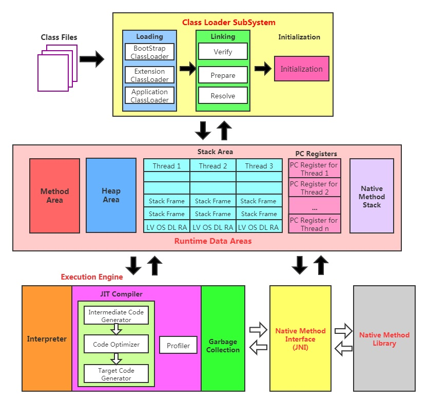
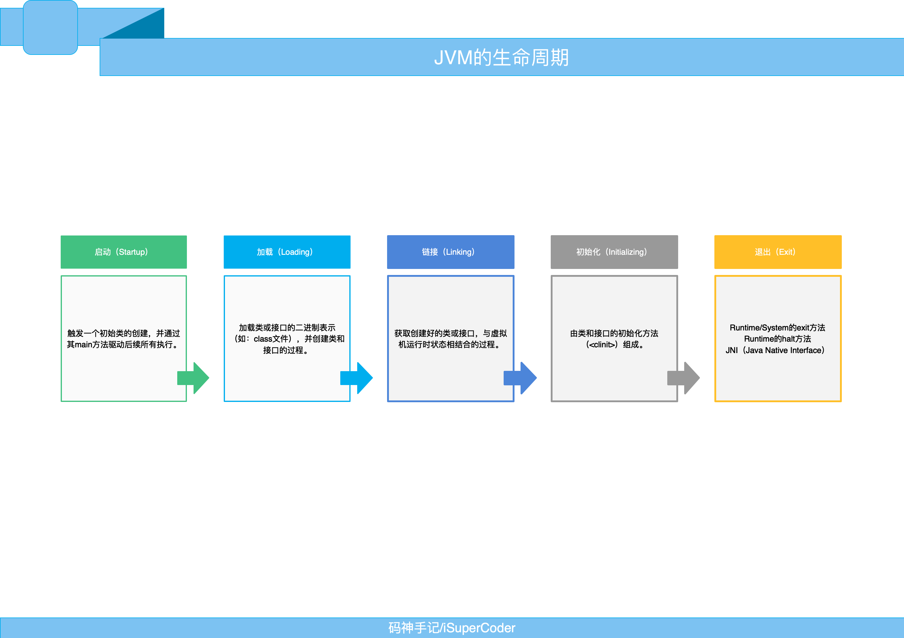

# JVM Study Start

## JVM 記憶體結構
1. Class Loader SubSystem: 讀取 .class JVM 中
2. Stack Area: 每個 Thread 單獨擁有一個
3. Heap Area、Method Area:  每個 Thread 共享
4. Execution Engine: 實際將 .class 編譯成機器語言，內容包含執意器與編譯器
5. Native Method Stack: 本地涵式庫使用
6. PC Registers: 程式計數器

## JVM 指令集架構
### 堆疊式架構
1. 設計簡單，適用於資源受限系統
2. 不需要擔心寄存器分配問題，但執行指令較多
3. 指令集中包含了零位址指令，其對於記憶體操作要求高
4. 不依賴硬體，移植性高
### 暫存器架構
1. 典型應用為x86架構，執行指令較少
2. 過於依賴硬體，移植性低
3. 由於使用CPU本身指令集所以效能較佳，執行效率高
4. 暫存器架構為多位址指令

## JVM 生命週期
* ### JVM 啟動
JVM 起動是透過 Bootstrap class loader 創建一個 initial class
來完成，這個類別是由其 JVM 實作來指定
* ### JVM 執行
JVM 在啟動後進入JVM main 進入點並加載一些 JVM class 完後會開始執行 Java 程式碼，當Java 程式碼執行完後 JVM 會停止運行
* ### JVM 退出
在以下情況下 JVM 將會停止:
1. Java 程式碼執行結束
2. 異常未處理
3. 手動退出(System.exit(0))
4. JNI(Java Native Interface) 使用 invocation API 來加載和卸載 JVM

## JVM 虛擬機
### Sun Classic VM
1. 在1996年 Java1.0 版由 Sun 公司提供的第一個 Java 商用虛擬機，在 JDK1.4 停止使用
2. 此虛擬機只提供直譯器
3. 現在的 Hotspot 虛擬機有包含此虛擬機
4. 若需要使用 JIT 及時編譯器就需要外掛，但一旦使用 JIT 及時編譯器時會接管虛擬機所有執行將不會使用直譯器，直譯器與及時編譯器不可共用

### Exact VM(Exact Memory Management)
1. 又稱為 Non-Conservative/accurate Memory Management
2. 可以準確地知道某個記憶體位址中的資料為甚麼類型
3. 熱點程式碼偵測
4. 及時編譯器與直譯器混合工作 
5. 只在 Sun Solaris 平台使用，沒多久後被 Hotspot 取代

### Hotspot VM
1. 最初由 Longview Technologies 設計後續被Sun公司收購，Sun 被 Oracle 收購
2. JDK1.3 之後為預設虛擬機，JDK6 及 JDK8 也是使用此虛擬機
3. 使用平台伺服器、行動裝置、嵌入式系統都使用此虛擬機
4. 通過計數器找到最需要編譯的程式碼，觸發及時編譯器或是記憶體 Stack 中更換
5. 通過編譯器及直譯器偕同工作，在執行時間與性能結果上取的平衡
6. 此虛擬機有方法區(Method Area)其他虛擬機沒有

### BEA JRockit VM
1. 此虛擬機不在乎編譯時運行速度(編譯速度慢)，因此內部包含直譯器實作，全部程式碼都會經過編譯
2. 因為所有程式馬偕編譯過，所以 JRockit 是世界上最快的虛擬機之一
3. JRockit 運行時性能較為優秀
4. JRockit 針對敏感型應用提供了 JRockit Real time 毫秒或微秒的 JVM 響應速度，適合金融、軍事、電信等要求高速環境
5. 提供 MissControl 套件，是一種性能開銷即低來監控、管理及分析的工具
6. 2008 年 Oracle 收購了 BEA 公司
7. Oracle 在 JDK1.8 中大致上以與 Hotspot 整合完畢

### IBM J9(IBM Technology for Java Virtual Machine)
1. 服務面向與Hotspot 相同，皆以伺服器、行動裝置、嵌入式系統為面向
2. 目前廣泛運用的三大虛擬中的其中一種
3. 2017 年 IBM J9 發布開源命名為 OpenJ9，並交由 Eclipse 基金會管理也稱為 Eclipse OpenJ9

### KVM、CDC 與 CLDC Hotspot
1. Oracle 針對行動裝置(ME)發布的虛擬機
2. 因目前行動裝置皆由 Android 與 IOS 最廣，位置較為尷尬
3. KVM 簡單、輕量、高度可移植性
4. KVM 為 CLDC-HI 早期產品
5. 應用資源受限裝置

### Azul VM
1. Azul 與 Liquid 皆綁定某些特定硬體，效能較三大虛擬還要更優秀
2. 應綁定某些特定硬體移植性較差
3. 運行在 Azul System 公司中的 Vega 系統上的虛擬機，可管理數十CPU和數百G記憶體，提供巨大可管理記憶體可控制的 GC 時間
4. 2010 年 Azul Systems 公司從硬體轉向軟體，發布兼容於 x86 平台上的 Zing JVM 提供了接近 Vega 系統的特性

### Liquid VM
1. 由 BEA 公司開發，運行在 Hypervisor 系統上
2. Liquid VM 即是 JRockit VE(Virtual Edition)，Liquid VM 不需要操作系統支持，內部包含作業系統的執行緒調度、文件管理系統及網路管理
3. 隨著 JRockit 停止更新，Liquid VM 也停止更新

### Apache Harmony
1. 兼容於 JDK1.5 與 JDK1.6 版本
2. 由 IBM 與 Intel 聯合開發開源的 JVM ，Sun 堅決不讓 Harmony 獲得 JCP 認證，最終於 2011 年終止更新
3. Harmony 中的函式庫被 Android SDK 大量使用

### Microsoft JVM
1. 微軟為了讓IE3瀏覽器支持 Java Applets 所開發的 JVM 
2. 只運行在 windows 平台下，運性效率加
3. 1997 年 Sun 以不當競爭指控微軟成功，windowsXP SP3中移除預設VM

### Dalvik VM
1. 為 Android 平台虛擬機，但未遵守 JVM 規範
2. 編譯過後的當案附檔名為 .dex
3. 使用暫存器指令架構
4. Android5.0 支持提前編譯(Ahead of Time Compilation)的ART VM 替換 Dalvik VM

## JVM Future
### Oracle Graal VM
1. 2018 年 Oracle Labs 公開發布 Graal VM，號稱"Run Programs Faster AnyWhere"展現了對Java 虛擬機的野心與1995年Java 的 "write once, run anywhere" 相呼應
2. Graal VM 在 Hotspot VM 基礎上增強了跨語言特性，可作為"任何語言"的運行平台使用，語言包刮Java、Scale、Groovy、Kotlin、C、C++、Javascript、Ruby、Python、R等
3. 支持跨語言混用介面與物件，支持與語言使用以編譯好的中間格式，通過直譯器轉換能被 Graal VM 接受的中間表示
4. Graal VM 提供 Truffle 工具集快速構建面向一種新語言的直譯器，在運行時即時編譯優化，獲得比原身編譯器更加的執行表現