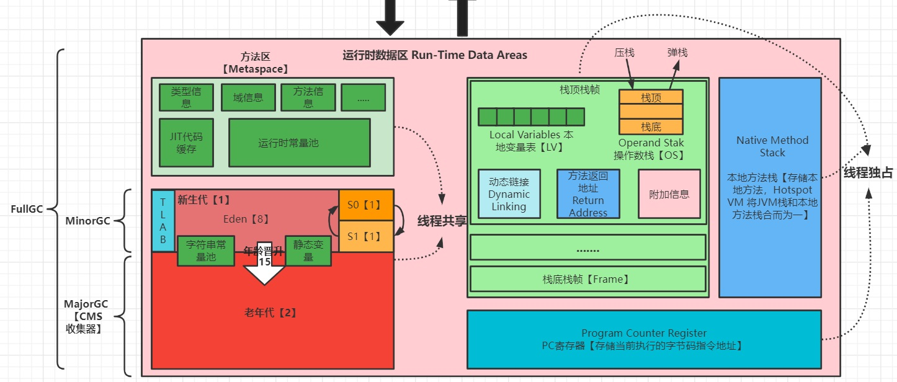

# Runtime Data Area

## Runtime Data Area 詳細結構

JVM Runtime Data Area（JVM運行時數據區域）是Java虛擬機（JVM）在運行時使用的內存區域。這個區域被劃分為幾個部分，每個部分都有特定的目的和使用方式。以下是JVM Runtime Data Area的幾個部分：
1. 程序計數器區域：是一個小的內存區域，可以看做是當前執行線程所執行的字節碼的行號指示器。當Java虛擬機執行字節碼指令時，程序計數器用來存儲下一條要執行的指令的地址，以便當前執行線程隨時回到執行的位置。
2. 虛擬機棧區域（JVM Stack）：是用於存儲局部變量、操作數棧、動態連接、方法出口等信息的區域。每個執行線程都有自己的虛擬機棧，用於支持方法調用和返回操作。虛擬機棧是線程私有的，它的生命周期與線程相同。當一個方法被執行時，虛擬機棧會為該方法創建一個棧帧，用於存儲該方法的相關信息。
3. 堆區域（Heap）：是Java虛擬機管理的內存區域，被用來存儲Java對象。在JVM啟動時，堆區域被劃分成三個區域：新生代、老年代和永久代。當Java程式創建一個對象時，堆區域會為其分配內存。
4. 方法區域（Method Area）：是用於存儲已經被JVM加載的類的結構信息、執行字節碼、方法和構造函數的執行代碼、靜態變量、常量和類型等信息的區域。方法區域是被所有線程共享的區域。
5. 常量池區域（Constant Pool）：是方法區域的一部分，用於存儲編譯期生成的各種字面量和符號引用。常量池區域在JVM加載類時被填充。
6. 本地方法棧區域（Native Method Stack）：與虛擬機棧區域相似，區別在於本地方法棧區域是為了支持本地方法（Native Method）的執行而設置的。當Java程式中需要調用C或C++等語言寫的原生程式庫時，JVM會使用本地方法接口（JNI）來實現對本地方法的調用，而本地方法棧則用於支持本地方法的執行。

## Runtime Data Area 各區域作用
1. 程序計數器區域：用於記錄每個線程下一步需要執行的指令。
2. 虛擬機棧區域：用於存儲方法的局部變量、方法參數、部分中間計算結果等數據，以及保存方法的調用和返回狀態。
3. 本地方法棧區域：用於存儲Java虛擬機使用本地代碼調用Native方法時的棧帧。
4. 堆區域：用於存儲Java程式運行期間動態分配的所有對象實例和數組。
5. 方法區域：用於存儲已經被加載的類型信息、常量、靜態變數、即時編譯器編譯後的代碼等數據。
6. 常量池區域：用於存儲編譯期間生成的字面量和符號引用。

## JVM 執行緒
1. JVM 允許一個應用程式有多個執行緒執行
2. 在 Hotspot VM 中每一個執行緒都對應了一個本機執行緒，但是動用哪個可用CPU則是由作業系統決定
3. 當作業系統初始化完執行緒後會呼叫 Java run() 方法執行應用程式
4. 作業系統會決定 JVM 是否要結束(發生異常RuntimeException)，而判斷是否結束的條件為是否為最後一個普通執行緒
5. 可以透過 jconsole 查看應用程式執行緒，但不包含 main 方法及 main 方法執行緒所自己建立的執行緒
##### 補充
1. 守護執行緒(Daemon Thread): 背景執行緒、守護線程
2. 普通執行緒(User Thread): 前景執行緒、一般執行緒

##### Hopspot 系統背景執行緒
1. 垃圾回收線程：Java中的垃圾回收是自動進行的，Hotspot系統中會啟動一個或多個垃圾回收線程來執行這項任務。垃圾回收線程會從堆中回收不再使用的對象，以釋放內存空間。
2. JIT編譯線程：Java程式中的熱點代碼（Hotspot Code）會被編譯成本地機器碼以提高執行效率，Hotspot系統中會啟動一個或多個JIT編譯線程來執行這項任務。JIT編譯線程會監視程式的執行情況，將經常使用的代碼編譯成本地機器碼以提高執行效率。
3. 載入器線程：Java程式中的類需要在執行期間動態加載，Hotspot系統中會啟動一個或多個載入器線程來執行這項任務。載入器線程負責從磁盤中加載類文件，並將其轉換成可執行的代碼。
4. 信號分發線程：在Unix/Linux系統中，信號是一種用於通知進程發生某些事件的機制。Hotspot系統中會啟動一個或多個信號分發線程來處理系統發出的信號，例如SIGSEGV信號表示運行時出現了段錯誤。
5. 定時器線程：Java程式中可以使用定時器（Timer）類別實現定時任務，Hotspot系統中會啟動一個或多個定時器線程來執行這項任務。定時器線程負責定期

## 程序計數器(Program Counter Registry)
[Java SE8 Virtual Machine Specification](https://docs.oracle.com/javase/specs/jvms/se8/html/jvms-2.html#jvms-2.5.1)  

``
javap -v <class file name>
``

* 熱點虛擬機中的程序計數器（Program Counter Register）是一塊小型的內存區域，用於記錄當前執行緒正在執行的 JVM 指令的地址或索引。
* 每個執行緒都有自己獨立的程序計數器，它在線程切換時被保存和恢復，因此每個執行緒都可以獨立地運行。
* 程序計數器通常是線程私有的，因此不會發生多執行緒競爭的問題。它主要用於實現 Java 方法調用、線程跳轉、執行緒同步和異常處理等功能，以及支持熱點編譯器進行優化。
* 在熱點編譯器優化的過程中，程序計數器扮演了非常重要的角色，因為它可以確定方法之間的調用關係，對熱點編譯器的優化有著重要的影響。
* 在 Hotspot 中，如果當前執行的方法是 Native 方法，即由 C 或 C++ 編寫的本地方法，那麼程序計數器的值為 undefined。
* 因為 Native 方法不是由 Java 虛擬機直接執行的，而是通過本地方法接口（JNI）調用 C 或 C++ 函數，並且在本地代碼中執行。在這種情況下，虛擬機不會維護程序計數器的值，因為本地代碼的執行是在虛擬機的控制之外的。
* 當 Native 方法完成後，控制權會返回虛擬機，程序計數器的值會被重新設置為返回虛擬機的位置。因此，程序計數器的值在 Native 方法的執行期間是未定義的。
* 程序計數器為是唯一沒有 OutOfMemoryError 也不會受到垃圾回收的影響的記憶體位址，因為只記錄指令的地址或索引

### 為何需要程序計數器(Program Counter Registry)
在JVM中，每個執行緒都需要一個獨立的程序計數器(Program Counter)來紀錄當前執行的位置，也就是下一條指令的地址，以便在處理器中執行指令。因為在JVM中，同一個進程可能有多個執行緒同時運行，如果每個執行緒都使用同一個程序計數器，那麼在切換執行緒的時候就會出現混亂，甚至是錯誤的情況。因此，JVM需要為每個執行緒分配一個獨立的程序計數器，這樣在切換執行緒的時候就能夠保證各自獨立，不會互相影響。