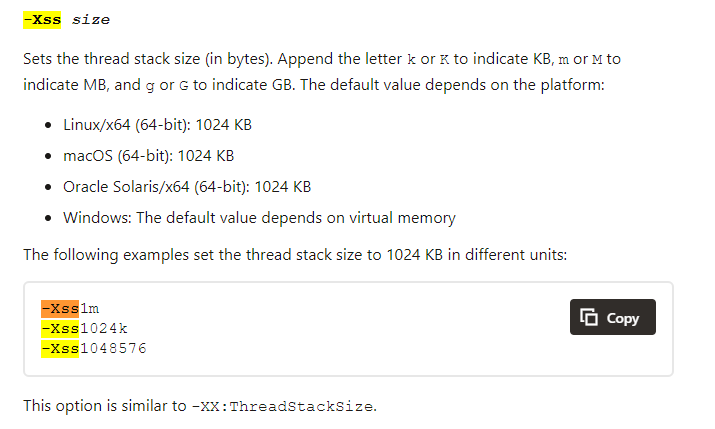
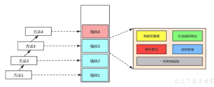

## 虛擬機棧區域（JVM Stack）
### 記憶體相關錯誤
#### StackOverflowError
發生情況:
當 Java 棧為固定大小時，若執行緒請求使用的棧(Stack)超過Java 虛擬機允許的棧(Stack)大小則會發生棧溢出錯誤，例:遞迴次數過多
#### OutOfMemoryError
發生情況:
當 Java 棧為動態大小時，若執行緒無法請求到可使用的棧(Stack)空間則會發生記憶體洩漏錯誤，例:陣列長度超過記憶體大小

### 棧(Stack)系統預設大小

### 棧偵(Stack frame)結構
* **區域變數表(Local Variables)**
    * 可儲存基本類型、物件類型及returnAddress類型
    * 因數據類型儲存在棧內故而無執行緒安全問題
    * 區域變數表大小是在編譯時期決定好的並保存在Code屬性中的maximum local variable,運行時部會更改
    * 區域變數表基本的储存單位為 Slot
    * 每一32位元占用1個 Slot(包括ReturnAddress類型),而byte、short、char會被轉換成int储存,boolean相同會被轉換成int储存,0代表false,1代表true,64位元占用2個Slot(包括double、long類型)
* 執行操作數表(Operand Stack)
* 方法回傳位址(Return Address)
* 動態連結(Dynamic Linking)
* 其他回傳資訊  

### 棧緩存技術

### 動態鏈結

### 方法呼叫:解析與派發

### 方法位址返回

## 堆區域（Heap）

## 方法區域（Method Area）

## 常量池區域（Constant Pool）

## 本地方法棧區域（Native Method Stack）